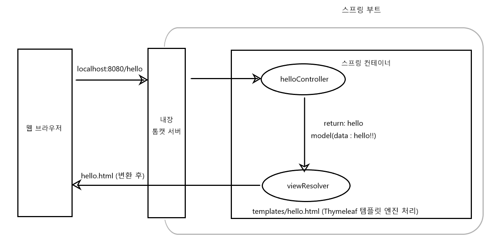
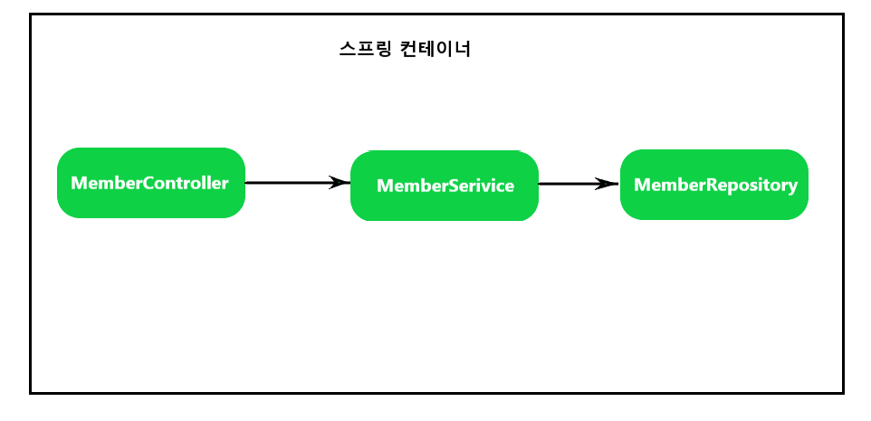
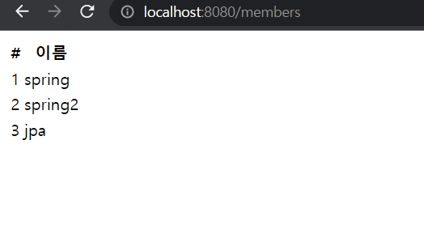
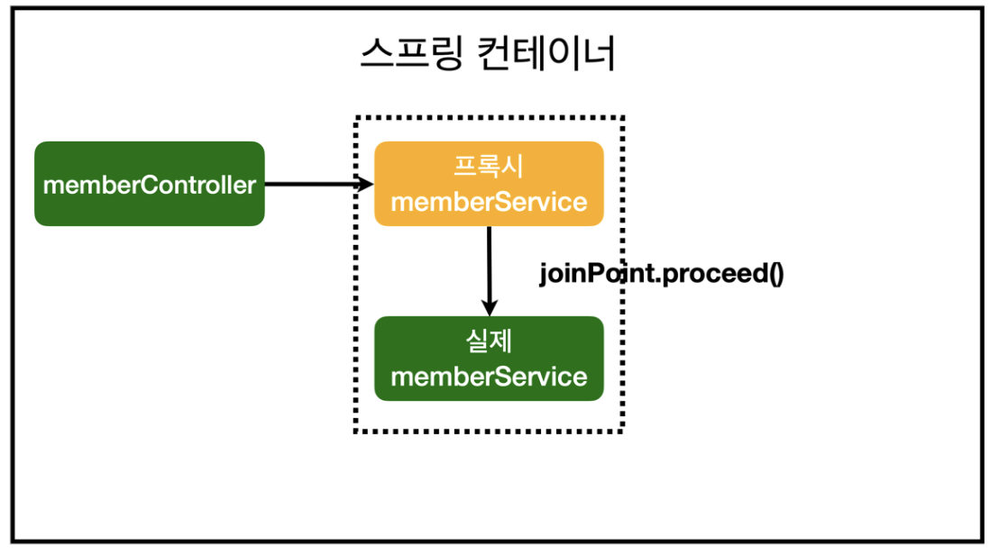

# 프로젝트 생성

spring boot를 사용할건데 [start.spring.io](http://start.spring.io) 사이트를 통해 프로젝트를 생성하면 편하게 프로젝트를 생성할 수 있다.


프로젝트 구성을 보면 src/main 폴더와 src/test 폴더가 나누어져있다.

- 요즘에는 maven이든 gradle이든 main이랑 test랑 나누어져있다.
- main에는 java폴더와 resources폴더로 나누어져있다.
    - resources폴더는 java파일들을 제외한 설정파일이나 xml파일 또는 html파일 등등이 들어가게 된다.
- test는 테스트 코드들과 관련된 파일들이 들어갈 폴더이다.
    - 요즘에는 테스트 코드가 굉장히 중요하다.

build.gradle

- 예전에는 개발자가 직접 이 파일을 입력했어햐하는데 요즘에는 [start.spring.io](http://start.spring.io) 같은 사이트에서 자동으로 생성해주기 때문에 굉장히 편해졌다.
- 알고있으면 좋지만 자세하게 파고들 필요는 없다.
    - ‘그냥 버전 설정하고 라이브러리를 땡겨오는구나’라고만 생각하면 된다.


```
plugins {
	id 'java'
	id 'org.springframework.boot' version '2.7.7'  -- spring boot 버전
	id 'io.spring.dependency-management' version '1.0.15.RELEASE'
}

group = 'hello'
version = '0.0.1-SNAPSHOT'
sourceCompatibility = '11'  -- java 버전

repositories {
	mavenCentral()
}

dependencies {
	implementation 'org.springframework.boot:spring-boot-starter-thymeleaf'
	implementation 'org.springframework.boot:spring-boot-starter-web'
	testImplementation 'org.springframework.boot:spring-boot-starter-test'
}

tasks.named('test') {
	useJUnitPlatform()
}
```

dependencies에 포함된 라이브러리들은 repositories에 적힌 mavenCentral이란 사이트에서 다운로드를 받아라라고 설정을 해놓은 것이다. 필요하면 특정 사이트를 입력해서 다운받게 하면 된다.

- HellSpringApplication

```java
package hello.hellspring;

import org.springframework.boot.SpringApplication;
import org.springframework.boot.autoconfigure.SpringBootApplication;

@SpringBootApplication
public class HellSpringApplication {

	public static void main(String[] args) {
		SpringApplication.run(HellSpringApplication.class, args);
	}

}
```

java의 실행 메소드인 main메소드가 있고 안에 해당 파일의 클래스 와 인자를 파라미터에 담고 특정 메소드를 실행한다.

해당 파일을 실행시키면 콘솔에


위와 같이 로그가 찍힌다.

그리고 localhost:8080에 접속해보면


위와 같이 표시가 되면 성공한것이다.

- 스프링 부트는 톰캣을 내장하고 있어 따로 설정해주지 않아도 자체적으로 톰캣서버를 실행시켜준다.


- **인텔리제이의 설정에 가서 build tool에서 gradle에 가면 빨간색으로 마크한 부분에 gradle로 설정이 되어있는걸 IntelliJ IDEA로 변경해주면 서버를 띄울때 gradle을 통하지 않고 인텔리제이 툴에서 바로 자바를 실행시켜 훨씬 빨리 서버를 실행시킬 수 있다.**

# 라이브러리 살펴보기


- 프로젝트의 라이브러리를 살펴보면 생각지도 못하게 엄청난 양의 라이브러리가 존재할 것이다.
- gradle이나 maven 같은 빌드 툴들은 의존 관계를 다 관리를 해준다.
    - spring-starter-web 라이브러리만 땡겨도 필요한 spring-starter-web 에 관련된 라이브러리 들까지 땡겨오는것이다.


- 표시해놓은 gradle버튼을 누르면 오른쪽에 gradle정보가 표시가 된다.


- 기본적으로 spring-boot-starter-thymeleaf와 spring-boot-starter-web 라이브러리가 있고 해당 라이브러리들과 관련된 라이브러리들까지 땡겨오는걸 확인할 수 있다.

### 스프링 부트 라이브러리

- spring-boot-starter-web
    - spring-boot-starter-tomcat : 톰캣(웹서버)
    - spring-webmvc : 스프링 웹 MVC
- spring-boot-starter-thymeleaf : 타임리프 템플릿 엔진(View)
- spring-boot-starter(공통) : 스프링 부트 + 스프링 코어 + 로깅
    - spring-boot
        - spring-core
    - spring-boot-starter-logging
        - logback, slf4j

### 테스트 라이브러리

- spring-boot-starter-test
    - junit : 테스트 프레임워크
    - mockito : 목 라이브러리
    - assertj : 테스트 코드를 좀 더 편하게 작성하게 도와주는 라이브러리
    - spring-test : 스프링 통합 테스트 지원

# View 환경설정

## Welcome Page 만들기

```html
<!DOCTYPE HTML>
<html>
<head>
    <title>Hello</title>
    <meta http-equiv="Content-Type" content="text/html; charset=UTF-8" />
</head>
<body>
Hello
<a href="/hello">hello</a>
</body>
</html>
```

- 스프링 부트가 제공하는 Welcome Page 기능
    - static/index.html 을 올려두면 Welcome page 기능을 제공한다.
    - http://docs.spring.io/spring-boot/docs/2.3.1.RELEASE/reference/html/spring-boot-features.html#boot-features-spring-mvc-welcome-page
    - [spring.io](http://spring.io) 스프링 참고 사이트

- thymeleaf 템플릿 엔진
    - thymeleaf 공식 사이트 : http://www.thymeleaf.org/
    - 스프링 공식 튜토리얼 : https://spring.io/guides/gs/serving-web-content/
    - 스프링부트 메류얼 : https://docs.spring.io/spring-boot/docs/2.3.1.RELEASE/reference/html/spring-boot-features.html#boot-features-spring-mvc-template-engines

## 동작 환경 그림



- 컨트롤러에서 리턴 값으로 문자를 반환하면 뷰 리졸버(`viewResolver`)가 화면을 찾아서 처리한다.
    - 스프링 부트 템플릿엔진 기본 viewName 매핑
    - `resoureces:templates/` + {ViewName} + `.html`


> 참고: `spring-boot-devtools` 라이브러리를 추가하면, `html` 파일을 컴파일만 해주면 서버 재시지가 없이 View 파일 변경이 가능한다.
인텔리J 컴파일 방법 : 메뉴 build → Recompile
>

# 빌드하고 실행하기

## 콘솔로 이동

1. ./gradlew build
2. cd build/libs
3. java -jar hell-spring-0.0.1-SNAPSHOT.jar
4. 실행 확인

# 스프링 웹 개발 기초

- 정적 컨텐츠
- MVC와 템플릿 엔진
- API

## 정적 컨텐츠

- 스프링 부트 정적 컨텐츠 기능
- [https://docs.spring.io/spring-boot/docs/2.3.1.RELEASE/reference/html/spring-boot-features.html#boot-features-spring-mvc-static-content](https://docs.spring.io/spring-boot/docs/2.3.1.RELEASE/reference/html/spring-boot-features.html#boot-features-spring-mvc-static-content)

`resources/static/hello-static.html`

```html
<!DOCTYPE html>
<html>
<head>
    <title>static contnet</title>
    <meta http-equiv="Content-Type" content="text/html; charset=UTF-8" />
</head>
<body>
정적 컨텐츠 입니다.
</body>
</html>
```

*실행*

- `http://localhost:8080/hello-static.html`


*정적 컨텐츠 이미지*


# MVC와 템플릿 엔진

- MVC: Model, View, Controller
- 과거에는 View와 Controller가 분리되어 있지않고 View에서 모든걸 다 처리했다.
  - `모델 1` 방식이라고 한다.
- View는 화면에 관련된 일만 처리
- Controller는 비즈니스 로직과 서버 뒷단에 관련된 일만 처리

`HelloController`

```java
@Controller
public class HelloController {
    @GetMapping("hello-mvc")
    public String helloMvc(@RequestParam("name") String name, Model model) {
        model.addAttribute("name", name);
        return "hello-template";
    }
}
```
※인텔리제이 팁 RequestParam에 커서를 넣고 `ctrl + p` 입력시 디폴트 값을 알 수 있다.

`hello-template`

```html
<html xmlns:th="http://www.thymeleaf.org">
<body>
<p th:text="'hello ' + ${name}">hello! empty</p>
</body>
</html>
```

*실행*

- [`http://localhost:8080/hello-mvc?name=spring`](http://localhost:8080/hello-mvc?name=spring)


- ${name}에 spring이 들어간걸 확인할 수 있다.

# API

`@ResponseBody 문자 반환`

```java
@Controller
public class HelloController {
    
    @GetMapping("hello-string")
    @ResponseBody
    public String helloString(@RequestParam("name") String name) {
        return "hello " + name; //"hello spring"
    }
}
```

- `@ResponseBody`를 사용하면 뷰 리졸버 (`viewResolver`)를 사용하지 않음
- 대신에 HTTP의 BODY에 문자 내용을 직접 반화(HTML BODY TAG를 말하는 것이 아님)

*실행*

- [`http://localhost:8080/hello-string?name=spring`](http://localhost:8080/hello-string?name=spring)

`@ResponseBody 객체 반환`

```java
@Controller
public class HelloController {

    @GetMapping("hello-api")
    @ResponseBody
    public Hello helloApi(@RequestParam("name") String name) {
        Hello hello = new Hello();
        hello.setName(name);
        return hello;
    }

    static class Hello {
        private String name;

        public String getName() {
            return name;
        }

        public void setName(String name) {
            this.name = name;
        }

    }
}
```

※인텔리제이 팁 Getter 와 Setter 자동 생성키 중에 Win방식으로 `alt + insert` 키를 입력시 자동 생성이 가능한다.

- `@ResponseBody`를 사용하고, 객체를 반환하면 객체가  JSON으로 변환됨
- Getter와 Setter같은 `프로퍼티 접근방식`이라고도 불린다.

*실행*

- [`http://localhost:8080/hello-api?name=spring`](http://localhost:8080/hello-api?name=spring)


- `@ResponseBody`를 사용
  - HTTP의 BODY에 문자 내용을 직접 반환
  - `viewResolver`대신에 `httpMessageConverter`가 동작
  - 기본 문자처리: `StringHttpMessageConverter`
  - 기복 객체처리: `MappingJackson2HttpMessageConverter`
  - byte 처리 등등 기타 여러  HttpMessageConverter가 기본으로 등록되어 있음

> 참고: 클라이언트의 HTTP Accept 해더와 서버의 컨트롤러 반환 타입 정보 둘을 조합해서
`HttpMessageConverter`가 선택된다.더 자세한 내용은 스프링 MVC강의에서 설명하겠다.
>

※클라이언의 HTTP Accept 해더: 클라이언트에서 서버에 요청시 Accept 값에 받고자 하는 형식을 입력해 해당 형식으로 받을 수 있다. ex) Ajax 또는 Axios에서 사용 가능

# 회원 관리 예제 - 백엔드 개발

- 비즈니스 요구사항 정리
- 회원 도메인과 리포지토리 만들기
- 회원 리포지토리 테스트 케이스 작성
- 회원 서비스 개발
- 회원 서비스 테스트

## 비즈니스 요구사항 정리

- 데이터: 회원ID, 이름
- 기능: 회원 등록, 조회
- 아직 데이터 저장소가 선정되지 않음(가상의 시나리오)


- 컨트롤러: 웹 MVC의 컨트롤러 역할
- 서비스: 핵심 비즈니스 로직 구현
- 리포지토리: 데이터베이스에 접근, 도메인 객체를 DB에 저장하고 관리
- 도메인: 비즈니스 도메인 객체, 예) 회원, 주문, 쿠폰 등등 주로 데이터베이스에 저장하고 관리됨

*클래스 의존관계*


- 아직 데이터 저장소가 선정되지 않아서, 우선 인터페이스로 구현 클래스를 변경할 수 있도록 설계
- 데이터 저장소는 RDB, NoSQL 등등 다양한 저장소를 고민중인 상황으로 가정
- 개발을 진행하기 위해서 초기 개발 단계에서는 구현체로 가벼운 메모리 기반의 데이터 저장소 사용

# 회원 도메인과 리포지토리 만들기

*회원 객체*

```java
package hello.hellspring.domain;

public class Member {

    private Long id;
    private String name;

    public Long getId() {
        return id;
    }

    public void setId(Long id) {
        this.id = id;
    }

    public String getName() {
        return name;
    }

    public void setName(String name) {
        this.name = name;
    }
}
```

*회원 리포지토리 인터페이스*

```java
package hello.hellspring.repository;

import hello.hellspring.domain.Member;

import java.util.List;
import java.util.Optional;

public interface MemberRepository {
    Member save(Member member);
    Optional<Member> findById(Long id);
    Optional<Member> findByName(String name);
    List<Member> findAll();
}
```

*회원 리포지토리 구현체*

```java
package hello.hellspring.repository;

import hello.hellspring.domain.Member;

import java.util.*;

public class MemoryMemberRepository implements MemberRepository {

    private static Map<Long, Member>  store = new HashMap<>();
    private static Long sequence = 0L;

    @Override
    public Member save(Member member) {
        member.setId(++sequence);
        store.put(member.getId(), member);
        return member;
    }

    @Override
    public Optional<Member> findById(Long id) {
        return Optional.ofNullable(store.get(id));
    }

    @Override
    public Optional<Member> findByName(String name) {
        return store.values().stream()
                .filter(member -> member.getName().equals(name))
                .findAny();
    }

    @Override
    public List<Member> findAll() {
        return new ArrayList<>(store.values());
    }
}
```

`findByName` 메소드에서 Lambda 방식을 사용
`Collection.values()`: 해당 컬렉션의 value값들을 `Collection`을 반환
`Collection.stream()`: `Collection` 객체를 `Stream`객체로 반환
`Stream.filter(boolean)`: 인수로 받은 프리디케이트(boolean을 반환하는 함수)의 값에 의해 true를 만족하는 모든 요소를 `Stream`객체로 반환
`Stream.findAny()`: `Stream`에서 가장 먼저 탐색되는 요소를 반환

# Stream

- java 8에서 추가된 `Stream`은 람다를 활용할 수 있는 기술 중 하나다.
- `Stream`을 추가되기 전에는 배열 또는 컬렉션 인스턴스를 다루는 방법은 `for` 또는 `foreach`문을 사용하여 요소를 하나씩 다루는 방법이었는데, `Stream`을 추가되면서 배열 또는 컬렉션 인스턴스에 함수 여러 개를 조합해서 원하는 결과를 필터링 하고 가공한 결과를 얻을 수 있게 되었다.

## Stream의 특징

- 병렬처리(multi-threading)가 가능하다.
- 내부 반복을 사용하여 코드의 양을 줄일 수 있다.

# Optional

- java 8에서는 `Optional<T>`클래스를 사용해 NPE(NullPointException)를 방지할 수 있다.
- `Optional<T>`는 null이 올 수 있는 값을 감싸는 Wrapper 클래스이다.

# 회원 리포지토리 테스트 케이스 작성

개발한 기능을 실행해서 테스트 할 때 자바의 main메서드를 통해서 실행하거나, 웹 애플리케이션의 컨트롤러를 통해서 해당 기능을 실행한다. 이러한 방법은 준비하고 실행하는데 오래 걸리고, 반복 실행하기 어렵고 여러 테스트를 한번에 실행하기 어렵다는 단점이 있다. 자바는 JUnit이라는 프로임워크로 테스트를 실행해서 이러한 문제를 해결한다.

*회원 리포지토리 메모리 구현체 테스트*

`src/test/java`하위 폴더에 생성한다.

```java
package hello.hellspring.repository;

import hello.hellspring.domain.Member;
import org.junit.jupiter.api.AfterEach;
import org.junit.jupiter.api.Test;

import java.util.List;

import static org.assertj.core.api.Assertions.assertThat;

class MemoryMemberRepositoryTest {

    MemoryMemberRepository repository = new MemoryMemberRepository();

    @AfterEach
    public void afterEach() {
        repository.clearStore();
    }

    @Test
    public void save() {
        Member member = new Member();
        member.setName("spring");

        repository.save(member);

        Member result = repository.findById(member.getId()).get();
        assertThat(member).isEqualTo(result);
    }

    @Test
    public void findByName() {
        Member member1 = new Member();
        member1.setName("spring1");
        repository.save(member1);

        Member member2 = new Member();
        member2.setName("spring2");
        repository.save(member2);

        Member result = repository.findByName("spring1").get();

        assertThat(result).isEqualTo(member1);
    }

    @Test
    public void findAll() {
        Member member1 = new Member();
        member1.setName("spring1");
        repository.save(member1);

        Member member2 = new Member();
        member2.setName("spring2");
        repository.save(member2);

        List<Member> result = repository.findAll();

        assertThat(result.size()).isEqualTo(2);
    }

}
```

*클래스 명*

```java
class MemoryMemberRepositoryTest {
}
```

1. 평소 클래스와 다르게 앞에 public 이 빠져있는데 테스트 케이스이기에 굳이 public으로 안해줘도 된다.
2. 테스트 하고자하는 클래스명에 뒤에 Test를 붙여 작성한다.

*save1*

```java
@Test
public void save() {
    Member member = new Member();
    member.setName("spring");
    
    repository.save(member);
    
    Member result = repository.findById(member.getId()).get();
    Asserions.assertEquals(result, member);
}
```

1. `repository.findById` 메소드의 반환값이 `Optional`이므로 `get()` 함수를 통해 Member를 반환받을 수 있다.
2. 위와 같이 바로 `get()`으로 값을 받는 방법은 좋은 방법이 아니지만 테스트 코드이므로 바로 반환 받도록 작성하였다.
3. `Assertions.assertEquals(expected, actual);` expected(기대값)과 actual(실제값)을 비교해주는 함수이다.

*실행*


- 실행을 하면 그냥 아무 출력된 로그없이 위와 같이 초록색으로 체크 모양이 표시됨.

*실행 - 인자가 서로 다를 경우*


`Assertions.assertEquals(null, member);`
실행시 X 모양이 표시가 되고 에러로그가 출력된다. 필요(expected) 값이 null이고 실제(actual)값이 member의 객체값이 표시된다.

*save2*

```java
import static org.assertj.core.api.Assertions.assertThat;

@Test
public void save() {
    Member member = new Member();
    member.setName("spring");

    repository.save(member);

    Member result = repository.findById(member.getId()).get();
    assertThat(member).isEqualTo(result);
}
```

1. save1에서 사용한 `Assertions`는 JUnit에 내장되어 있는 클래스인데 요즘에는 `assertj.core`에 내장되어있는 `Assertions`가 사용하기 편해 많이 쓰는 추세입니다.
2. ※인텔리제이 팁 `Assertions.assertThat(member).isEqualTo(result);`에서 `Assertions`에 커서를 놓고 `alt + enter`를 입력시 `org.assertj.core.api.Assertions.assertThat`를 import해서 그냥 `assertThat`으로 사용가능하다.
3. `assertThat(actual).isEqualTo(expected);` 똑같이 expected(기대값)과 actual(실제값)을 비교해주는 함수이다.

*findByName*

```java
@Test
public void findByName() {
    Member member1 = new Member();
    member1.setName("spring1");
    repository.save(member1);

    Member member2 = new Member();
    member2.setName("spring2");
    repository.save(member2);

    Member result = repository.findByName("spring1").get();

    assertThat(result).isEqualTo(member1);
}
```

*실행*


*실행 - 인자가 서로 다를 경우*


`assertThat(result).isEqualTo(member2);`
필요값에 member1의 객체값이 표시,
실제값에 member2의 객체값이 표시된다.

*findAll*

```java
@Test
public void findAll() {
    Member member1 = new Member();
    member1.setName("spring1");
    repository.save(member1);

    Member member2 = new Member();
    member2.setName("spring2");
    repository.save(member2);

    List<Member> result = repository.findAll();

    assertThat(result.size()).isEqualTo(2);
}
```

*실행*


*실행 - 인자가 서로 다를 경우*


`assertThat(result.size()).isEqualTo(3);`
위와 같이 필요값과 실제값이 표시된다.

*테스트 클래스를 한번에 실행*


빨갛게 표시된 부분을 클릭하면 정의되어 있는 테스트들이 한번에 모두 실행이 된다.

*현재 테스트 클래스 소스*

```java
package hello.hellspring.repository;

import hello.hellspring.domain.Member;
import org.junit.jupiter.api.Test;

import java.util.List;

import static org.assertj.core.api.Assertions.assertThat;

class MemoryMemberRepositoryTest {

    MemberRepository repository = new MemoryMemberRepository();

    @Test
    public void save() {
        Member member = new Member();
        member.setName("spring");

        repository.save(member);

        Member result = repository.findById(member.getId()).get();
        assertThat(member).isEqualTo(result);
    }

    @Test
    public void findByName() {
        Member member1 = new Member();
        member1.setName("spring1");
        repository.save(member1);

        Member member2 = new Member();
        member2.setName("spring2");
        repository.save(member2);

        Member result = repository.findByName("spring1").get();

        assertThat(result).isEqualTo(member1);
    }

    @Test
    public void findAll() {
        Member member1 = new Member();
        member1.setName("spring1");
        repository.save(member1);

        Member member2 = new Member();
        member2.setName("spring2");
        repository.save(member2);

        List<Member> result = repository.findAll();

        assertThat(result.size()).isEqualTo(2);
    }

}
```

*실행*


findAll()이 먼저 실행되고 findByName()이 실패한걸 확인 할 수 있다.
테스트 소스를 한번에 실행 시 순서보장이 안되기 때문에 MemoryMemberRepository의 로컬변수 store에는 findAll() 함수에서 member 객체가 두 개 들어가고 findByName() 함수에서 또 name값이 같은 member 객체가 두 개가 들어가서 findByName에서 두 객체를 비교할때 result에 반환된 객체가 findAll() 함수에서 입력한 member객체이기에 실패하는 것을 확인할 수 있다.

*해결방법*

*MemoryMemberRepository*

```java
public void clearStore() {
    store.clear();
}
```
MemoryMemberRepository 클래스에 해당 함수를 정의해준다.
`store.clear()` → Collection에 값들을 비워준다.

*MemoryMemberRepositoryTest*

`MemberRepository repository -> MemoryMemberRepository repository로 변경`

```java
@AfterEach
public void afterEach() {
    repository.clearStore();
}
```
@AfterEach는 테스트 메소드가 끝나고 호출되는 callback 메소드이다.

*실행*


- 모두 정상적으로 실행되는걸 확인할 수 있다.

### 테스트 주도 개발 (Test Driven Development의 약자 TDD)

- 반복 테스트를 이용한 소프트웨어 방법론으로 작은 단위의 테스트 케이스를 작성하고 이를 통과하는 코드를 추가하는 단계를 반복하여 구현하는것을 말한다.

# 회원 서비스 개발

*MemberService*

```java
package hello.hellspring.service;

import hello.hellspring.domain.Member;
import hello.hellspring.repository.MemberRepository;
import hello.hellspring.repository.MemoryMemberRepository;

import java.util.List;
import java.util.Optional;

public class MemberService {

    private final MemberRepository memberRepository = new MemoryMemberRepository();

		/**
		     *회원 가입
		*/
		public Long join(Member member) {
        //같은 이름이 있는 중복 회원X
        validateDuplicateMember(member); //중복 회원 검증
        memberRepository.save(member);
        return member.getId();
    }
	
    private void validateDuplicateMember(Member member) {
        memberRepository.findByName(member.getName())
                .ifPresent(m -> {
                    throw new IllegalStateException("이미 존재하는 회원입니다.");
                });
    }

		/**
		     *전체 회원 조회
		*/
		public List<Member> findMembers() {
		    return memberRepository.findAll();
		}

    public Optional<Member> findOne(Long memberId) {
        return memberRepository.findById(memberId);
    }
}
```

※인텔리제이 팁 `ctrl + shift + alt + t`입력 시 리팩토링 기능 중 메소드 추출시 메소드를 따로 빼낼 수 있음.
`ctrl + alt + v`입력 시 반환 변수가 자동으로 입력됨.

- `ifPresent()` → 값이 있으면 동작 true를 반환
  - 과거에는 `if ( result == null )` 이런식으로 코딩을 했지만 지금은 객체값이 null일 가능성이 있으면 `Optional`로 한번 감싸줘서 `ifPresent()` 메소드를 사용가능스
- 서비스 클래스는 비즈니스에 가까운 용어를 사용해야한다. → 비즈니스에 의존적으로 설계를 해야함.
- 리포지토리는 개발스럽게 용어를 사용하면 됨.

# 회원 서비스 테스트

*MemberService*

```java
public class MemberService {
    ...
}
```

- `MemberService` 파일에서 클래스 명에 커서를 대고 `ctrl + shift + t`입력 후 ‘새 테스트 생성’ 버튼 클릭 시 자동으로 테스트 파일을 생성해준다.

*MemberServiceTest*

```java
package hello.hellspring.service;

import org.junit.jupiter.api.Test;

import static org.junit.jupiter.api.Assertions.*;

class MemberServiceTest {

    @Test
    void join() {
    }

    @Test
    void findMembers() {
    }

    @Test
    void findOne() {
    }
}
```

```java
@Test
void 회원가입() {
}
```

테스트 코드는 빌드될때 실제 코드에 포함되지 않아서 테스트 코드는 한글로 메소드명을 작성해도 상관없다.

*테스트 코드 작성*

```java
@Test
void 회원가입() {
    //given
    Member member = new Member();
    member.setName("hello");

    //when
    Long saveId = memberService.join(member);

    //then
    Member findMember = memberService.findOne(saveId).get();
    assertThat(member.getName()).isEqualTo(findMember.getName());
}
```

`given - when -then 패턴` 이라고 하며 준비 - 실행 - 검증 의 세 부분으로 나눈것이다.
테스트가 작을 때 보다 클 때 이런 주석으로 구분을 지어놓으면 시각적으로 보는데 도움이 많이 된다.

*테스트는 정상 플로우도 중요하지만 예외 플로우가 더 중요하다.*

```java
@Test
public void 중복_회원_예외() {
    //given
    Member member1 = new Member();
    member1.setName("spring");

    Member member2 = new Member();
    member2.setName("spring");

    //when
    memberService.join(member1);
    assertThrows(IllegalStateException.class, () -> memberService.join(member2));

    //then
}
```

//when 에서 member1을 가입시키고 member2를 가입시킬때 두 객체의 name값이 같기 때문에 member2 객체를 회원가입 시킬 때 `MemberService`의 `IllegalStateException("이미 존재하는 회원입니다.")`해당 예외가 발생할 것이다.
해당 예외를 `try catch`로 `Exception`의 내용을 확인해볼 수 있지만 더 좋은 문법을 제공을 해준다.

- `assertThrows(IllegalStateException.class, () -> memberService.join(member2));`
  - `() -> memberService.join(member)` 해당 로직을 실행시키면 예외가 발생하는데 `IllegalStateException.class` 해당 예외가 발생하는지 비교해주는 함수이다.

*실행*


- `assertThrows(NullPointerException.class, () -> memberService.join(member2));`으로 변경 시

*실행*


테스트가 실패하는게 확인됨

*`assertThrows()`함수를 사용하여 메시지를 검증하는 방법*

```java
@Test
public void 중복_회원_예외() {
    //given
    Member member1 = new Member();
    member1.setName("spring");

    Member member2 = new Member();
    member2.setName("spring");

    //when
    memberService.join(member1);
    IllegalStateException e = assertThrows(IllegalStateException.class, () -> memberService.join(member2));

    assertThat(e.getMessage()).isEqualTo("이미 존재하는 회원입니다.");

    //then
}
```

`assertThrows`의 반환값이 `Exception`이라 예외 객체를 받아 `assertThat`으로 비교가 가능하다.

*MemberServiceTest*

```java
package hello.hellspring.service;

import hello.hellspring.domain.Member;
import org.junit.jupiter.api.Test;

import static org.assertj.core.api.Assertions.assertThat;
import static org.junit.jupiter.api.Assertions.assertThrows;

class MemberServiceTest {

    MemberService memberService = new MemberService();

    @Test
    void 회원가입() {
        //given
        Member member = new Member();
        member.setName("spring");

        //when
        Long saveId = memberService.join(member);

        //then
        Member findMember = memberService.findOne(saveId).get();
        assertThat(member.getName()).isEqualTo(findMember.getName());
    }

    @Test
    public void 중복_회원_예외() {
        //given
        Member member1 = new Member();
        member1.setName("spring");

        Member member2 = new Member();
        member2.setName("spring");

        //when
        memberService.join(member1);
        IllegalStateException e = assertThrows(IllegalStateException.class, () -> memberService.join(member2));

        assertThat(e.getMessage()).isEqualTo("이미 존재하는 회원입니다.");
/*
        try {
            memberService.join(member2);
            fail();
        } catch (IllegalStateException e) {
            assertThat(e.getMessage()).isEqualTo("이미 존재하는 회원입니다.123123");
        }
*/

        //then
    }

    @Test
    void findMembers() {
    }

    @Test
    void findOne() {
    }
}
```

*`회원가입`에서 함수에서 객체의 `name`을 hello → spring 으로 변경 후 전체 테스트 실행*


- `중복_회원_예외()`함수에서 입력한 객체의 `name`값이 “spring”이므로 테스트 실행 중 예외가 발생한다.

*해결방법*

- `MemberRepositoryTest`에서 했던 방식과 같이 각각의 테스트 케이스 실행 후 값을 비워주는 함수를 실행해주도록 한다.
  - `@AfterEach`사용

*MemberServiceTest*

```java
package hello.hellspring.service;

import hello.hellspring.domain.Member;
import hello.hellspring.repository.MemoryMemberRepository;
import org.junit.jupiter.api.AfterEach;
import org.junit.jupiter.api.Test;

import static org.assertj.core.api.Assertions.assertThat;
import static org.junit.jupiter.api.Assertions.assertThrows;

class MemberServiceTest {

    MemberService memberService = new MemberService();
    MemoryMemberRepository memberRepository = new MemoryMemberRepository();

    @AfterEach
    public void afterEach() {
        memberRepository.clearStore();
    }

    @Test
    void 회원가입() {
        //given
        Member member = new Member();
        member.setName("spring");

        //when
        Long saveId = memberService.join(member);

        //then
        Member findMember = memberService.findOne(saveId).get();
        assertThat(member.getName()).isEqualTo(findMember.getName());
    }

    @Test
    public void 중복_회원_예외() {
        //given
        Member member1 = new Member();
        member1.setName("spring");

        Member member2 = new Member();
        member2.setName("spring");

        //when
        memberService.join(member1);
        IllegalStateException e = assertThrows(IllegalStateException.class, () -> memberService.join(member2));

        assertThat(e.getMessage()).isEqualTo("이미 존재하는 회원입니다.");

        //then
    }

    @Test
    void findMembers() {
    }

    @Test
    void findOne() {
    }
}
```

- ※인텔리제이 팁 `shift + F10` 입력 시 최근에 했던 테스트 케이스를 실행시켜준다.

*실행*


## DI(의존성 주입)

*MemberServiceTest*

```java
class MemberServiceTest {

    MemberService memberService = new MemberService();
    MemoryMemberRepository memberRepository = new MemoryMemberRepository();
    ...
}
```

*MemberService*

```java
public class MemberService {

    private final MemberRepository memberRepository = new MemoryMemberRepository();
    ...
}
```

- `MemberServiceTest`의 `MemoryMemberRepository` 객체와 `MemberService`의 `MemoryMemberRepository`객체는 서로 다른 객체기 때문에 문제가 발생할 수 있다.

*MemberService*

```java
public class MemberService {

    private final MemberRepository memberRepository;

    public MemberService(MemberRepository memberRepository) {
        this.memberRepository = memberRepository;
    }
    ...
}
```

`MemberRepository`를 인자로 받는 `MemberService`의 생성자를 만들어 객체를 직접 넣어준다.

*MemberServiceTest*

```java
class MemberServiceTest {

    MemberService memberService;
    MemoryMemberRepository memberRepository;

    @BeforeEach
    public void beforeEach() {
        memberRepository = new MemoryMemberRepository();
        memberService = new MemberService(memberRepository);
    }
    ...
}
```

`@BeforeEach`를 사용하여 테스트를 동작하기 전에 객체를 생성해준다.
이렇게 하면 `MemberServiceTest`의 `MemoryMemberRepository`객체와 `MemberService`의 `MemoryMemberRepository`는 같은 메모리상에 존재하는 객체가 된다.
해당 방식이 DI이다.

# 스프링 빈과 의존관계

## 스프링 빈을 등록하고, 의존관계 설정하기

- 회원 컨트롤러가 회원서비스와 회원 리포지토리를 사용할 수 있게 의존관계를 준비하자

*회원 컨트롤러에 의존관계 추가*

```java
package hello.hellspring.controller;

import hello.hellspring.service.MemberService;
import org.springframework.beans.factory.annotation.Autowired;
import org.springframework.stereotype.Controller;

@Controller
public class MemberController {

    private final MemberService memberService;

    @Autowired
    public MemberController(MemberService memberService) {
        this.memberService = memberService;
    }
}
```

- 스프링이 처음 실행될 때 스프링 컨테이너가 생성되는데 여기에 `@Controller` 어노테이션이 있는 해당 객체를 생성해서 저장하고 관리를 하게된다.
- 생성자에 `@Autowired`가 있으면 스프링이 연관된 객체를 스프링 컨테이너에서 찾아서 넣어준다. 이렇게 객체 의존관계를 외부에서 넣어주는 것을 DI(Dependency Injection), 의존성 주입이라 한다.
- 이전 테스트에서는 개발자가 직접 주입했고, 여기서는 `@Autowired`에 의해 스프링이 주입해준다.

*오류 발생*

```
Consider defining a bean of type 'hello.hellspring.service.MemberService' in your configuration.
```

*memberService가 스프링 빈으로 등록되어 있지 않다.*


> 참고: MemberController는 스프링이 제공하는 컨트롤러여서 스프링 빈으로 자동 등록된다.
`@Controller`가 있으면 자동 등록됨
>

## 스프링 빈을 등록하는 2가지 방법

- 컴포넌트 스캔과 자동 의존관계 설정
- 자바 코드로 직접 스프링 빈 등록하기

### 컴포넌트 스캔과 자동 의존관계 설정

- `@Component`애노테이션이 있으면 스프링 빈으로 자동 등록된다.
- `@Controller`컨트롤러가 스프링 빈으로 자동 등록된 이유도 컴포넌트 스캔 때문이다.
- `@Component`를 포함하는 다음 애노테이션도 스프링 빈으로 자동 등록된다.
  - `@Controller`
  - `@Service`
  - `@Repository`

*회원 서비스 스프링 빈 등록*

```java
@Service
public class MemberService {

    private final MemberRepository memberRepository;

    @Autowired
    public MemberService(MemberRepository memberRepository) {
        this.memberRepository = memberRepository;
    }

}
```

> 참고: 생성자에 `@Autowired`를 사용하면 객체 생성 시점에 스프링 컨테이너에서 해당 스프링 빈을 찾아서 주입한다. 생성자가 1개만 있으면 `@Autowired`는 생략할 수 있다.
>

*회원 리포지토리 스프링 빈 등록*

```java
@Repository
public class MemoryMemberRepository implements MemberRepository {}
```

*스프링 빈 등록 이미지*



- `MemberService`와 `MemberRepository`가 스프링 컨테이너에서 스프링 빈으로 등록되었다.

> 참고: 스프링은 스프링 컨테이너에 스프링 빈을 등록할 때, 기본으로 싱글톤으로 등록한다.(유일하게 하나만 등록해서 공유한다) 따라서 같은 스프링 빈이면 모두 같은 인스턴스다. 설정으로 싱글톤이 아니게 설정할 수 있지만, 특별한 경우를 제외하면 대부분 싱글톤을 사용한다.
>

### 자바 코드로 직접 스프링 빈 등록하기

- 회원 서비스와 회원 리포지토리의 `@Service`, `@Repository`, `@Autowired` 애노테이션을 제거하고 진행한다.

```java
package hello.hellspring;

import hello.hellspring.repository.MemberRepository;
import hello.hellspring.repository.MemoryMemberRepository;
import hello.hellspring.service.MemberService;
import org.springframework.context.annotation.Bean;
import org.springframework.context.annotation.Configuration;

@Configuration
public class SpringConfig {

    @Bean
    public MemberService memberService() {
        return new MemberService(memberRepository());
    }

    @Bean
    public MemberRepository memberRepository() {
        return new MemoryMemberRepository();
    }
}
```

> 참고: XML로 설정하는 방식도 있지만 최근에는 잘 사용하지 않으므로 생략한다.
>

> 참고: DI에는 필드 주입, setter 주입, 생성자 주입 이렇게 3가지 방법이 있다. 의존관계가 실행중에 동적으로 변하는 경우는 거의 없으므로 생성자 주입을 권장한다.
>

*필드 주입*

```java
@Controller
public class MemberController {
    @Autowired
    private final MemberService memberService;

}
```

의존관계가 변경이 불가능하여 요즘에는 잘 사용안함

*setter 주입*

```java
@Controller
public class MemberController {

    private final MemberService memberService;

    @Autowired
    public void setMemberService(MemberService memberService) {
        this.memberService = memberService;
    }
}
```

*생성자 주입*

```java
@Controller
public class MemberController {

    private final MemberService memberService;

    @Autowired
    public MemberController(MemberService memberService) {
        this.memberService = memberService;
    }
}
```

> 참고: 실무에서는 주로 정형화된 컨트롤러, 서비스, 리포지토리 같은 코드는 컴포넌트 스캔을 사용한다. 그리고 정형화되지 않거나, 상황에 따라 구현 클래스를 변경해야 하면 설정을 통해 스프링 빈으로 등록한다.
>

> 주의: `@Autowired`를 통한 DI는 `MemberController`, `MemberService`등과 같이 스프링이 관리하는 객체에서만 동작한다. 스프링 빈으로 등록하지 않고 내가 직접 생성한 객체에서는 동작하지않는다.
>

# 회원 관리 예제 - 웹 MVC 개발

- 회원 웹 기능 - 홈 화면 추가
- 회원 웹 기능 - 등록
- 회원 웹 기능 - 조회

## 회원 웹 기능 - 홈 화면 추가

*홈 컨트롤러 추가*

```java
package hello.hellspring.controller;

import org.springframework.stereotype.Controller;
import org.springframework.web.bind.annotation.GetMapping;

@Controller
public class HomeController {

    @GetMapping("/")
    public String home() {
        return "home";
    }
}
```

*회원 관리용 홈*

```html
<!DOCTYPE html>
<html xmlns:th="http://www.thymeleaf.org">
<body>

<div class="container">
    <div>
        <h1>Hello Spring</h1>
        <p>회원 기능</p>
        <p>
            <a href="/members/new">회원 가입</a>
            <a href="/members">회원 목록</a>
        </p>
    </div>
</div><!-- /container -->

</body>
</html>
```

*실행*  [`http://localhost:8080/`](http://localhost:8080/)


- 이전에는 index.html이 존재하면 welcome 페이지라서 `localhost:8080`요청시 index.html 화면이 리턴된다고 한적이 있는데 home.html 화면이 리턴된 이유는 정적 컨텐츠(static)
  즉, index.html화면은 관련 컨트롤러가 있는지 먼저 체크하고 없을 경우에 리턴이 된다.

## 회원 웹 기능 - 등록

### 회원 등록 폼 개발

*회원 등록 폼 컨트롤러*

```java
package hello.hellspring.controller;

import hello.hellspring.domain.Member;
import hello.hellspring.service.MemberService;
import org.springframework.beans.factory.annotation.Autowired;
import org.springframework.stereotype.Controller;
import org.springframework.web.bind.annotation.GetMapping;
import org.springframework.web.bind.annotation.PostMapping;

@Controller
public class MemberController {

    private final MemberService memberService;

    @Autowired
    public MemberController(MemberService memberService) {
        this.memberService = memberService;
    }

    @GetMapping("/members/new")
    public String createForm() {
        return "members/createMemberForm";
    }

    @PostMapping("/members/new")
    public String create(MemberForm form) {
        Member member = new Member();
        member.setName(form.getName());

        memberService.join(member);

        return "redirect:/";
    }
}
```

*회원 등록 폼 HTML*

```html
<!DOCTYPE html>
<html xmlns:th="http://www.thymeleaf.org">
<body>

<div class="container">

    <form action="/members/new" method="post">
        <div class="form-group">
            <label for="name">이름</label>
            <input type="text" id="name" name="name" placeholder="이름을 입력하세요">
        </div>
        <button type="submit">등록</button>
    </form>
</div><!-- /container -->

</body>
</html>
```

- `/members/new/`를 post방식으로 호출시 화면에서 받은 `<form>`태그 안에 있는`name`값을 스프링이 `MemberForm`의 `setName`을 사용하여 값을 세팅해준다.

## 회원 웹 기능 - 조회

*회원 컨트롤러에서 조회 기능*

```java
@GetMapping("/members")
public String list(Model model) {
    List<Member> members = memberService.findMembers();
    model.addAttribute("members", members);
    return "members/memberList";
}
```

*회원 리스트 HTML*

```html
<!DOCTYPE html>
<html xmlns:ht="http://www.thymelear.org">
<body>

<div class="container">
    <div>
        <table>
            <thead>
            <tr>
                <th>#</th>
                <th>이름</th>
            </tr>
            </thead>
            <tbody>
            <tr th:each="member : ${members}">
                <td th:text="${member.id}"></td>
                <td th:text="${member.name}"></td>
            </tr>
            </tbody>
        </table>
    </div>
</div><!-- container -->
</body>
</html>
```

*실행*


- 회원 가입 화면에서 spring1과 spring2를 등록한다.


- 회원 목록 화면에서 등록 되어있는 회원이 표시된다.

*페이지 소스*

```html
<!DOCTYPE html>
<html xmlns:ht="http://www.thymelear.org">
<body>

<div class="container">
    <div>
        <table>
            <thead>
            <tr>
                <th>#</th>
                <th>이름</th>
            </tr>
            </thead>
            <tbody>
            <tr>
                <td>1</td>
                <td>spring1</td>
            </tr>
            <tr>
                <td>2</td>
                <td>spring2</td>
            </tr>
            </tbody>
        </table>
    </div>
</div><!-- container -->
</body>
</html>
```

- `MemberController`에서 `memberService.findMembers()`메소드로 받은 Member 목록을 `members`라는 key값에 담았다.
- `${members}`를 통해 Member 목록을 꺼낼 수 있게 된다.
- `thymeleaf` 문법 중 `th:each : ${members}` 를 사용하여 해당 태그 안에 있는 html 태그를 반복하여 생성해준다.
- `th:text="${member.id}"`와 `th:text="${member.name}"`을 통해 Member객체의 id와 name값을 화면에 표시할 수 있게 된다.

# 스프링 DB 접근 기술

스프링 데이터 액세스

- H2 데이터베이스 설치
- 순수 Jdbc
- 스프링 JdbcTemplate
- JPA
- 스프링 데이터 JPA

## H2 데이터베이스 설치

개발이나 테스트 용도로 가볍고 편리한 DB, 웹 화면 제공

- [https://h2database.com/html/main.html](https://h2database.com/html/main.html)
- zip 파일을 다운받아 압축을 풀고 bin 디렉토리 아래의 h2.bat 또는 h2w.bat을 실행하면 H2 데이터베이스가 서버 모드로 실행된다.
  - Unix 계열은 h2.sh를 실행한다.


- 화면이 뜨고 나서 잘 작동하지 않을때 앞의 192.xxx.x.xxx:8082~~ 이런식으로 url이 있을텐데 192.xxx.x.xxx를 localhost로 변경해주면 잘 작동한다.

- JDBC URL 칸을 보면 `jdbc:h2:~/test`로 기본값이 들어가있다.
  - 해당 경로는 내 홈의 test파일 경로를 뜻한다.

이대로 연결 버튼을 누르면 DB가 만들어진다.


왼쪽 상단에 빨간 버튼을 누르면 연결을 해제할 수 있다.

- 여기서 확인해야 할게 자기 홈(C:\Users\name)에 test.mv.db라는 파일이 있어야 한다.


- 확인이 되었으면 이후부터는 파일로 접근을 하게되면 동시에 애플리케이션이랑 웹 콘솔이 같이 접근이 안되거나 충돌이 날 수 있어서 JDBC URL에 `jdbc:h2:~/test`이 아니라 `jdbc:h2:tcp://localhost/~/test`로 접근을 해야한다.
  - `jdbc:h2:tcp://localhost/~/test`이렇게 접근을 하면 파일에 직접 접근하는게 아니라 소캣을 통해서 접근을 해서 여러 곳에서 접근이 가능하게 된다.

*member table 생성*

```sql
drop table if exists member CASCADE;
create table member
(
	id bigint generated by default as identity,
	name varchar(255),
	primary key(id)
);
```

- `generated by default as identity` → 해당 컬럼의 값을 세팅하지 않고 insert하면 DB가 자동으로 id값을 채워준다.
- `insert into member(name) values ('spring1')`
- `insert into member(name) values ('spring2')`

명령어 실행 후

- `SELECT * FROM MEMBER` 실행 시


자동으로 id 값이 저장된걸 확인할 수 있다.

## 순수 Jdbc

### 환경 설정

*build.gradle 파일에 jdbc, h2 데이터베이스 관련 라이브러리 추가*

```
implementation 'org.springframework.boot:spring-boot-starter-jdbc'
runtimeOnly 'com.h2database:h2'
```

- dependencies에 소스 추가 후


- 빨갛게 표시한 코끼리 버튼이 화면에 표시되고 버튼을 누르면 빌드를 시작한다.

*스프링 부트 데이터베이스 연결 설정 추가*

```
spring.datasource.url=jdbc:h2:tcp://localhost/~/test
spring.datasource.driver-class-name=org.h2.Driver
spring.datasource.username=sa
```

### Jdbc 리포지토리 구현

- JDBC API 방식으로 코딩을 할건데 해당 방식은 15년 전에 사용했던 방식으로 참고만 하면된다.

```java
package hello.hellspring.repository;

import hello.hellspring.domain.Member;
import org.springframework.jdbc.datasource.DataSourceUtils;

import javax.sql.DataSource;
import java.sql.*;
import java.util.ArrayList;
import java.util.List;
import java.util.Optional;
public class JdbcMemberRepository implements MemberRepository {
    private final DataSource dataSource;
    public JdbcMemberRepository(DataSource dataSource) {
        this.dataSource = dataSource;
    }
    @Override
    public Member save(Member member) {
        String sql = "insert into member(name) values(?)";
        Connection conn = null;
        PreparedStatement pstmt = null;
        ResultSet rs = null;
        try {
            conn = getConnection();
            pstmt = conn.prepareStatement(sql,
                    Statement.RETURN_GENERATED_KEYS);
            pstmt.setString(1, member.getName());
            pstmt.executeUpdate();
            rs = pstmt.getGeneratedKeys();
            if (rs.next()) {
                member.setId(rs.getLong(1));
            } else {
                throw new SQLException("id 조회 실패");
            }
            return member;
        } catch (Exception e) {
            throw new IllegalStateException(e);
        } finally {
            close(conn, pstmt, rs);
        }
    }
    @Override
    public Optional<Member> findById(Long id) {
        String sql = "select * from member where id = ?";
        Connection conn = null;
        PreparedStatement pstmt = null;
        ResultSet rs = null;
        try {
            conn = getConnection();
            pstmt = conn.prepareStatement(sql);
            pstmt.setLong(1, id);
            rs = pstmt.executeQuery();
            if(rs.next()) {
                Member member = new Member();
                member.setId(rs.getLong("id"));
                member.setName(rs.getString("name"));
                return Optional.of(member);
            } else {
                return Optional.empty();
            }
        } catch (Exception e) {
            throw new IllegalStateException(e);
        } finally {
            close(conn, pstmt, rs);
        }
    }
    @Override
    public List<Member> findAll() {
        String sql = "select * from member";
        Connection conn = null;
        PreparedStatement pstmt = null;
        ResultSet rs = null;
        try {
            conn = getConnection();
            pstmt = conn.prepareStatement(sql);
            rs = pstmt.executeQuery();
            List<Member> members = new ArrayList<>();
            while(rs.next()) {
                Member member = new Member();
                member.setId(rs.getLong("id"));
                member.setName(rs.getString("name"));
                members.add(member);
            }
            return members;
        } catch (Exception e) {
            throw new IllegalStateException(e);
        } finally {
            close(conn, pstmt, rs);
        }
    }
    @Override
    public Optional<Member> findByName(String name) {
        String sql = "select * from member where name = ?";
        Connection conn = null;
        PreparedStatement pstmt = null;
        ResultSet rs = null;
        try {
            conn = getConnection();
            pstmt = conn.prepareStatement(sql);
            pstmt.setString(1, name);
            rs = pstmt.executeQuery();
            if(rs.next()) {
                Member member = new Member();
                member.setId(rs.getLong("id"));
                member.setName(rs.getString("name"));
                return Optional.of(member);
            }
            return Optional.empty();
        } catch (Exception e) {
            throw new IllegalStateException(e);
        } finally {
            close(conn, pstmt, rs);
        }
    }
    private Connection getConnection() {
        return DataSourceUtils.getConnection(dataSource);
    }
    private void close(Connection conn, PreparedStatement pstmt, ResultSet rs)
    {
        try {
            if (rs != null) {
                rs.close();
            }
        } catch (SQLException e) {
            e.printStackTrace();
        }
        try {
            if (pstmt != null) {
                pstmt.close();
            }
        } catch (SQLException e) {
            e.printStackTrace();
        }
        try {
            if (conn != null) {
                close(conn);
            }
        } catch (SQLException e) {
            e.printStackTrace();
        }
    }
    private void close(Connection conn) throws SQLException {
        DataSourceUtils.releaseConnection(conn, dataSource);
    }
}
```

*스프링 설정 변경*

```java
package hello.hellspring;

import hello.hellspring.repository.JdbcMemberRepository;
import hello.hellspring.repository.MemberRepository;
import hello.hellspring.repository.MemoryMemberRepository;
import hello.hellspring.service.MemberService;
import org.springframework.beans.factory.annotation.Autowired;
import org.springframework.context.annotation.Bean;
import org.springframework.context.annotation.Configuration;

import javax.sql.DataSource;

@Configuration
public class SpringConfig {

    private DataSource dataSource;

    @Autowired
    public SpringConfig(DataSource dataSource) {
        this.dataSource = dataSource;
    }

    @Bean
    public MemberService memberService() {
        return new MemberService(memberRepository());
    }

    @Bean
    public MemberRepository memberRepository() {
//        return new MemoryMemberRepository();
        return new JdbcMemberRepository(dataSource);
    }
}
```

- 스프링을 쓰는 이유
  - `MemberRepository memberRepository()`의`return new JdbcMemberRepository(dataSource);`같이 다형성을 활용할 수 있다.
    - → 인터페이스를 두고 구현체를 바꿔끼기가 가능하다. (SpringConfig에서만 수정하여 구현체를 변경할 수 있다)
    - 스프링 컨테이너가 지원해준다.
  - 개방-폐쇄 원칙(OCP, Open-Closed Principle)
    - 확장에는 열려있고, 수정, 변경에는 닫혀있다.
  - 스프링의 DI(Dependencies Injection)을 사용하면 **기준 코드를 손대지 않고, 설정만으로 구현 클래스를 변경**할 수 있다.

*테스트 실행*


- h2 콘솔에서 insert명령어로 입력한 spring과 spring2가 목록에 표시된다.


- 화면에서 jpa를 등록한다.




회원목록 화면이랑 h2 콘솔에서 jpa가 저장된걸 확인할 수 있다.
## 스프링 통합 테스트

**회원 서비스 스프링 통합 테스트**

```java
package hello.hellspring.service;

import hello.hellspring.domain.Member;
import hello.hellspring.repository.MemberRepository;
import org.junit.jupiter.api.AfterEach;
import org.junit.jupiter.api.Test;
import org.springframework.beans.factory.annotation.Autowired;
import org.springframework.boot.test.context.SpringBootTest;
import org.springframework.transaction.annotation.Transactional;

import static org.assertj.core.api.Assertions.assertThat;
import static org.junit.jupiter.api.Assertions.assertThrows;

@SpringBootTest
@Transactional
class MemberServiceIntegrationTest {

    @Autowired
    MemberService memberService;
    @Autowired
    MemberRepository memberRepository;

    @Test
    void 회원가입() {
        //given
        Member member = new Member();
        member.setName("spring");

        //when
        Long saveId = memberService.join(member);

        //then
        Member findMember = memberService.findOne(saveId).get();
        assertThat(member.getName()).isEqualTo(findMember.getName());
    }

    @Test
    public void 중복_회원_예외() {
        //given
        Member member1 = new Member();
        member1.setName("spring");

        Member member2 = new Member();
        member2.setName("spring");

        //when
        memberService.join(member1);
        IllegalStateException e = assertThrows(IllegalStateException.class, () -> memberService.join(member2));

        assertThat(e.getMessage()).isEqualTo("이미 존재하는 회원입니다.");

    }
    
}
```

- `@SpringBootTest:`스프링 컨테이너와 테스트를 함께 실행한다.
- `@Transactional:`테스트 케이스에 이 애노테이션이 있으면, 테스트 시작전에 트랜잭션을 시작하고, 테스트 완료 후에 항상 롤백한다. 이렇게 하면 DB에 데이터가 남지않아 다음 테스트에 영향을 주지 않는다.

## 스프링 JdbcTemplate

- 순수 Jdbc와 동일한 환경설정을 하면 된다.
- 스프링 JdbcTemplate과 MyBatis 같은 라이브러리는 JDBC

**스프링 jdbcTemplate 회원 리포지토리**

```java
package hello.hellspring.repository;

import hello.hellspring.domain.Member;
import org.springframework.jdbc.core.JdbcTemplate;
import org.springframework.jdbc.core.RowMapper;
import org.springframework.jdbc.core.namedparam.MapSqlParameterSource;
import org.springframework.jdbc.core.simple.SimpleJdbcInsert;

import javax.sql.DataSource;
import java.sql.ResultSet;
import java.sql.SQLException;
import java.util.HashMap;
import java.util.List;
import java.util.Map;
import java.util.Optional;

public class JdbcTemplateMemberRepository implements MemberRepository {

    private final JdbcTemplate jdbcTemplate;

    // 생성자가 하나라서 @Autowired 생략이 가능하다.
    public JdbcTemplateMemberRepository(DataSource dataSource) {
        jdbcTemplate = new JdbcTemplate(dataSource);
    }

    @Override
    public Member save(Member member) {
        SimpleJdbcInsert jdbcInsert = new SimpleJdbcInsert(jdbcTemplate);
        jdbcInsert.withTableName("member").usingGeneratedKeyColumns("id");
        Map<String, Object> parameters = new HashMap<>();
        parameters.put("name", member.getName());
        Number key = jdbcInsert.executeAndReturnKey(new
                MapSqlParameterSource(parameters));
        member.setId(key.longValue());
        return member;
    }

    @Override
    public Optional<Member> findById(Long id) {
        List<Member> result = jdbcTemplate.query("select * from member where id = ?", memberRowMapper(), id);
        return result.stream().findAny();
    }

    @Override
    public Optional<Member> findByName(String name) {
        List<Member> result = jdbcTemplate.query("select * from member where name = ?", memberRowMapper(), name);
        return result.stream().findAny();
    }

    @Override
    public List<Member> findAll() {
        return jdbcTemplate.query("select * from member", memberRowMapper());
    }

    private RowMapper<Member> memberRowMapper() {
        return new RowMapper<Member>() {
            @Override
            public Member mapRow(ResultSet rs, int rowNum) throws SQLException {

                Member member = new Member();
                member.setId(rs.getLong("id"));
                member.setName(rs.getString("name"));
                return member;
            }
        };
    }
}
```


- `jdbcInsert.withTableName("member").usingGeneratedKeyColumns("id");` 해당 코드를 보면 member 테이블에 id를 키값으로 사용하겠다라는걸 확인할 수 있다.
- 해당 `jdbcInsert`를 통해 파라미터만 세팅해줘도 직접 query를 안짜도 JdbcTemplate이 insert쿼리를 제공해준다.

**JdbcTemplate을 사용하도록 스프링 설정 변경**

```java
package hello.hellspring;

import hello.hellspring.repository.JdbcMemberRepository;
import hello.hellspring.repository.JdbcTemplateMemberRepository;
import hello.hellspring.repository.MemberRepository;
import hello.hellspring.repository.MemoryMemberRepository;
import hello.hellspring.service.MemberService;
import org.springframework.beans.factory.annotation.Autowired;
import org.springframework.context.annotation.Bean;
import org.springframework.context.annotation.Configuration;

import javax.sql.DataSource;

@Configuration
public class SpringConfig {

    private DataSource dataSource;

    @Autowired
    public SpringConfig(DataSource dataSource) {
        this.dataSource = dataSource;
    }

    @Bean
    public MemberService memberService() {
        return new MemberService(memberRepository());
    }

    @Bean
    public MemberRepository memberRepository() {
//        return new MemoryMemberRepository();
//        return new JdbcMemberRepository(dataSource);
        return new JdbcTemplateMemberRepository(dataSource);
    }
}
```

## JPA

- JPA는 기존의 반복 코드는 물론이고, 기본적인 SQL도 JPA가 직접 만들어서 실행해준다.
- JPA를 사용하면, SQL과 데이터 중심의 설계에서 객체 중심의 설계로 패러다임을 전환을 할 수 있다.
- JPA를 사용하면 개발 생산성을 크게 높일 수 있다.

build.gradle 파일에 JPA, h2 데이터베이스 관련 라이브러리 추가

```
plugins {
	id 'java'
	id 'org.springframework.boot' version '2.7.7'
	id 'io.spring.dependency-management' version '1.0.15.RELEASE'
}

group = 'hello'
version = '0.0.1-SNAPSHOT'
sourceCompatibility = '11'

repositories {
	mavenCentral()
}

dependencies {
	implementation 'org.springframework.boot:spring-boot-starter-thymeleaf'
	implementation 'org.springframework.boot:spring-boot-starter-web'
//	implementation 'org.springframework.boot:spring-boot-starter-jdbc'
	implementation 'org.springframework.boot:spring-boot-stater-data-jpa'
	runtimeOnly 'com.h2database:h2'
	testImplementation('org.springframework.boot:spring-boot-starter-test') {
		exclude group: 'org.junit.vintage', module: 'junit-vintage-engine'
	}
}

test {
	useJUnitPlatform()
}
```

- `spring-boot-starter-data-jpa`는 내부에 jdbc관련 라이브러리를 포함하고 있어 jdbc는 제거해도 된다.

**스프링 부트에 JPA 설정 추가**
`resources/application.properties`

```
spring.datasource.url=jdbc:h2:tcp://localhost/~/test
spring.datasource.driver-class-name=org.h2.Driver
spring.datasource.username=sa
spring.jpa.show-sql=true
spring.jpa.hibernate.ddl-auto=none
```

- `show-sql`: JPA가 생성하는 SQL을 출력한다.
- `ddl-auto`: JPA는 테이블을 자동으로 생성하는 기능을 제공하는데 `none`을 사용하면 해당 기능을 끈다.
  - `create`를 사용하면 엔티티 정보를 바탕으로 테이블도 직접 생성해준다.

> 참고: JPA는 인터페이스이며 구현체로 Hibernate가 존재한다.
대부분 Hibernate만 사용한다.
>

**JPA 엔티티 매핑**

```java
package hello.hellspring.domain;

import javax.persistence.Entity;
import javax.persistence.GeneratedValue;
import javax.persistence.GenerationType;
import javax.persistence.Id;

@Entity
public class Member {

    @Id
    @GeneratedValue(strategy = GenerationType.IDENTITY)
    private Long id;

    private String name;

    public Long getId() {
        return id;
    }

    public void setId(Long id) {
        this.id = id;
    }

    public String getName() {
        return name;
    }

    public void setName(String name) {
        this.name = name;
    }
}
```

- h2 콘솔에서 member 테이블을 생성할때 `id bigint generated by default as identity`이런 명령어를 사용해서 member 데이터를 삽입할때 id값을 세팅해주지 않아도 알아서 값이 세팅되었었는데, JPA엔티티에서는 `@GeneratedValue(strategy = GenerationType.IDENTITY)`를 명시해해줘서 위와 같이 사용할 수 있게 된다.

**JPA 회원 리포지토리**

```java
package hello.hellspring.repository;

import hello.hellspring.domain.Member;

import javax.persistence.EntityManager;
import java.util.List;
import java.util.Optional;

public class JpaMemberRepository implements MemberRepository {

    private final EntityManager em;

    public JpaMemberRepository(EntityManager em) {
        this.em = em;
    }

    @Override
    public Member save(Member member) {
        em.persist(member);
        return member;
    }

    @Override
    public Optional<Member> findById(Long id) {
        Member member = em.find(Member.class, id);
        return Optional.ofNullable(member);
    }

    @Override
    public Optional<Member> findByName(String name) {
        List<Member> result = em.createQuery("select m from Member m where m.name = :name", Member.class)
                .setParameter("name", name)
                .getResultList();

        return result.stream().findAny();
    }

    @Override
    public List<Member> findAll() {
        return em.createQuery("select m from Member m", Member.class)
                .getResultList();
    }
    // 리스트를 조회할때 단건이 아니거나 PK기반이 아닌 나머지들은 jpql을 작성해 줘야 한다.
}
```

- `build.gradle`파일에서 `implementation 'org.springframework.boot:spring-boot-stater-data-jpa'` 명령어를 통해서 라이브러리를 받으면 스프링 부트가 자동으로 `EntityManager`를 빈으로 등록해줘서 우리는 주입(Injection)받기만 하면된다.
- 리스트를 조회할 때 단건이 아니거나 PK기반이 아닌 나머지들은 jpql을 작성해 줘야한다.
  - `"select m from Member m where m.name = :name"`


**서비스 계층에 트랜잭션 추가**

```java
import org.springframework.transaction.annotation.Transactional
@Transactional
public class MemberService {}
```

- `org.springframework.transaction.annotation.Transactional`을 사용하자.
- 스프링은 해당 클래스의 메소드를 실행할때 트랜잭션을 시작하고, 메소드가 정상 종료되면 트랜잭션을 커밋한다. 만약 런타임 예외가 발생하면 롤백한다.
- **JPA를 통한 모든 데이터 변경은 트랜잭션 안에서 실행해야한다.**

**JPA를 사용하도록 스프링 설정 변경**

```java
package hello.hellspring;

import hello.hellspring.repository.*;
import hello.hellspring.service.MemberService;
import org.springframework.beans.factory.annotation.Autowired;
import org.springframework.context.annotation.Bean;
import org.springframework.context.annotation.Configuration;

import javax.persistence.EntityManager;
import javax.persistence.PersistenceContext;
import javax.sql.DataSource;

@Configuration
public class SpringConfig {

    @PersistenceContext
    private EntityManager em;

    @Autowired
    public SpringConfig(EntityManager em) {
        this.em = em;
    }

    @Bean
    public MemberService memberService() {
        return new MemberService(memberRepository());
    }

    @Bean
    public MemberRepository memberRepository() {
//        return new MemoryMemberRepository();
//        return new JdbcMemberRepository(dataSource);
//        return new JdbcTemplateMemberRepository(dataSource);
        return new JpaMemberRepository(em);
    }
}
```

- `@PersistenceContext`는 없어도 스프링이 처리해준다.
  - 스프링에서는 영속성 관리를 위해 `EntityManager`가 존재한다.
  - 스프링 컨테이너가 실행될 때 `EntityManager`를 빈으로 등록한다.
  - 이때 `EntityManager`를 주입받을때 필요한게 `@PersistenceContext`이다. (생략 가능)

**MemberServiceIntegrationTest실행**


- 회원가입 테스트가 잘 돌아간게 확인된다.
- Hibernate: select member0_.id as id1_0_, member0_.name as name2_0_ from member member0_ where member0_.name=?
  - JPA 인터페이스의 구현체로 Hibernate가 사용이 되어 `findByName` 쿼리를 실행시킨거다.
- Hibernate: insert into member (id, name) values (default, ?)
  - 위와 같이 Hibernate가 사용되어 `save` 쿼리가 실행되고 id 에는 null 들어가는데 `@GeneratedValue(strategy = GenerationType.IDENTITY)`에 의해 id값이 자동으로 들어간다.

# 스프링 데이터 JPA

> 주의: *스프링 데이터 JPA는 JPA를 편리하게 사용하도록 도와주는 기술입니다. 따라서 JPA를 먼저 학습한 후에 스프링 데이터 JPA를 학습해야 합니다.*
>

**스프링 데이터 JPA 회원 리포지토리**

```java
package hello.hellspring.repository;

import hello.hellspring.domain.Member;
import org.springframework.data.jpa.repository.JpaRepository;

import java.util.Optional;

public interface SpringDataJpaMemberRepository extends JpaRepository<Member, Long>, MemberRepository {

    @Override
    Optional<Member> findByName(String name);
}
```

- findByName이 실행되면 스프링 데이터 JPA가 JPQL로 select m from Member m where m.name = ?쿼리를 짜주고 해당 쿼리가 실행이 된다.

**스프링 데이터 JPA 회원 리포지토리를 사용하도록 스프링 설정 변경**

```java
package hello.hellspring;

import hello.hellspring.repository.MemberRepository;
import hello.hellspring.service.MemberService;
import org.springframework.context.annotation.Bean;
import org.springframework.context.annotation.Configuration;

@Configuration
public class SpringConfig {

    private final MemberRepository memberRepository;

    public SpringConfig(MemberRepository memberRepository) {
        this.memberRepository = memberRepository;
    }

    @Bean
    public MemberService memberService() {
        return new MemberService(memberRepository);
    }
}
```

- 스프링 데이터 JPA가 `SpringDataJpaMemberRepository`를 스프링 빈으로 자동 등록해준다.
  - JpaRepository를 상속받으면 자동으로 등록됨.


**스프링 데이터 JPA 제공 클래스**


**스프링 데이터 JPA 제공 기능**

- 인터페이스를 통한 기본적인 CRUD
- `findByName()`, `findByEmail()`처럼 메서드 이름 만으로 조회 기능 제공
- 페이징 기능 자동 제공

> 참고: 실무에서는 JPA와 스프링 데이터 JPA를 기본으로 사용하고, 복잡한 동적 쿼리는 Querydsl이라는 라이브러리를 사용하면 된다. Querydsl을 사용하면 쿼리도 자바 코드로 안전하게 작성할 수 있고,  동적 쿼리도 편리하게 작성할 수 있다. 이 조합으로 해결하기 어려운 쿼리는 JPA가 제공하는 네이티브 쿼리를 사용하거나, 앞서 학습한 스프링 JdbcTemplate를 사용하면 된다.
>

# AOP

## AOP가 필요한 상황

- 모든 메소드의 호출 시간을 측정하고 싶다면?
- 공통 관심 사항(cross-cutting concern) vs 핵심 관심 사항(core concern)
- 회원가입 시간, 회원 조회 시간을 측정하고 싶다면?


**MemberService 회원 가 시간 측정 추가**

```java
public Long join(Member member) {

    long start = System.currentTimeMillis();

    //같은 이름이 있는 중복 회원X
    try {
        validateDuplicateMember(member); //중복 회원 검증
        memberRepository.save(member);
        return member.getId();
    } finally {
        long finish = System.currentTimeMillis();
        long timeMs = finish - start;
        System.out.println("join = " + timeMs + "ms");
    }
}
```

*문제*

- 회원가입, 회원 조회에 시간을 측정하는 기능은 핵심 관심 사항이 아니다
- 시간을 측정하는 로직은 공통 관심 사항이다.
- 시간을 측정하는 로직과 핵심 비즈니스의 로직이 섞여서 유지보수가 어렵다.
- 시간을 측정하는 로직을 별도의 공통 로직으로 만들기 매우 어렵다.
- 시간을 측정하는 로직을 변경할 때 모든 로직을 찾아가면서 변경해야 한다.

## AOP 적용

- AOP: Aspect Orientd programming
- 공통 관심 사항(cross-cutting concern) vs 핵심 관심 사항(core concern) 분리


**시간 측정 AOP 등록**

```java
package hello.hellspring.aop;

import org.aspectj.lang.ProceedingJoinPoint;
import org.aspectj.lang.annotation.Around;
import org.aspectj.lang.annotation.Aspect;
import org.springframework.stereotype.Component;

@Aspect
@Component
public class TimeTraceAop {

    @Around("execution(* hello.hellspring..*(..))")
    public Object execute(ProceedingJoinPoint joinPoint) throws Throwable {
        long start = System.currentTimeMillis();
        System.out.println("START: " + joinPoint.toString());
        try {
            return joinPoint.proceed();
        } finally {
            long finish = System.currentTimeMillis();
            long timeMs = finish - start;
            System.out.println("END: " + joinPoint.toString() + " " + timeMs + "ms");
        }
    }
}
```

- 여기서는 `@Component`를 사용하였지만 AOP는 `SpringConfig`에 직접 등록하여 이런 AOP가 등록되어 쓰이고 있구나 하고 명확하게 표시해주는게 좋다.

*해결*

- 회원가입, 회원 조회등 핵심 관심사항과 시간을 측정하는 공통 관심 사항을 분리한다.
- 시간을 측정하는 로직을 별도의 공통 로직으로 만들었다.
- 핵심 관심 사항을 깔끔하게 유지할 수 있다.
- 변경이 필요하면 이 로직만 변경하면 된다.
- 원하는 적용 대상을 선택할 수 있다.

### 스프링의 AOP 동작 방식 설명

**AOP 적용 전 의존 관계**


**AOP 적용 후 의존 관계**



- AOP를 적용하면 스프링 컨테이너 `MemberService`를 등록할때 ‘프록시’라하는 가짜 `MemberService`를 등록한다. `MemberController`는 ‘프록시’ 객체를 의존하고 있다가 `joinPoint.proceed()`가 실행되면 실제 `MemberService`가 호출된다.

**AOP 적용 전 전체 그림**


**AOP 적용 후 전체 그림**


*실제 Proxy 주입되는지 콘솔에서 확인하기*

```java
@Autowired
public MemberController(MemberService memberService) {
    this.memberService = memberService;
    System.out.println("memberService = " + memberService.getClass());
}
```

